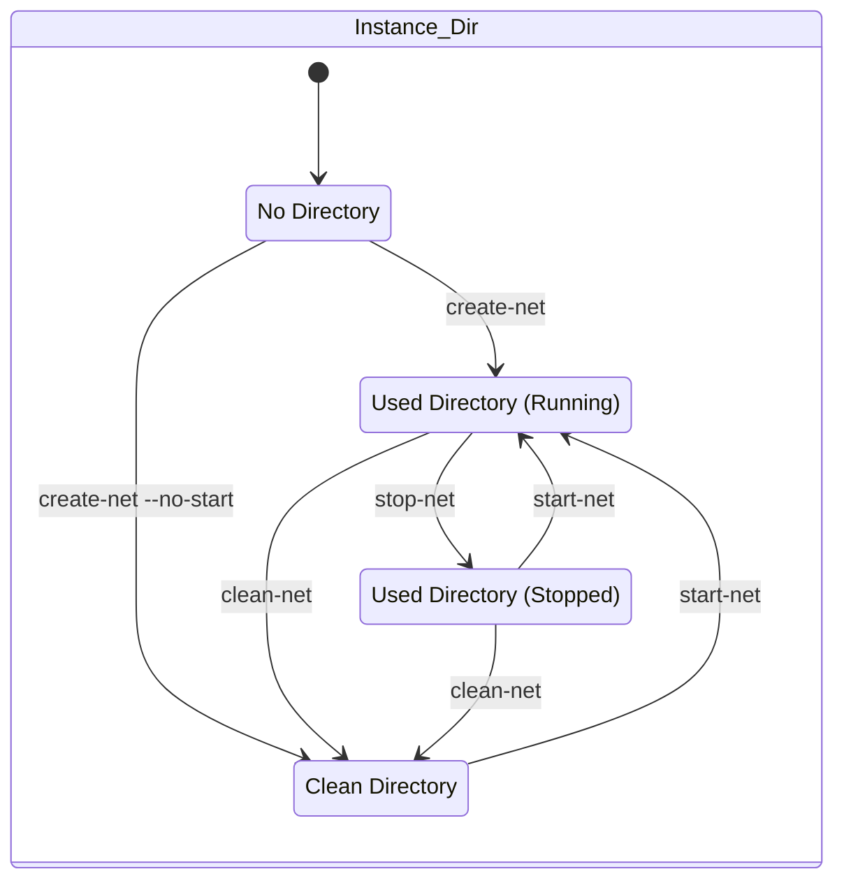

```mermaid

  stateDiagram

    state Instance_Dir {
      no_dir: No Directory
      clean_dir: Clean Directory
      used_dir_stopped: Used Directory (Stopped)
      used_dir_running: Used Directory (Running)

      [*] --> no_dir

      no_dir --> used_dir_running: create-net

      no_dir --> clean_dir: create-net --no-start

      used_dir_running --> used_dir_stopped: stop-net

      used_dir_running --> clean_dir: clean-net

      used_dir_stopped --> used_dir_running: start-net

      used_dir_stopped --> clean_dir: clean-net

      clean_dir --> used_dir_running: start-net
    }
```
