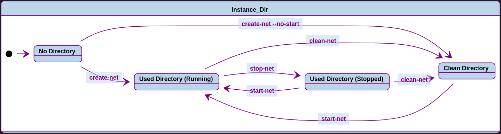

# Shardus Network Tool

### `instance_dir`

The base directory of a single Shardus instance.

```
shardus-instance-9001/
  logs/
  db/
  config.json
  statistics.tsv
  ...(other application specific files)
```

### `network_dir`

The home directory of a `PM2` managed network created with the `shardus` tool.
Contains the `instance_dir`s of all the nodes participating in that network.

```
instances/
  .pm2/ (PM2 config and logs)
  network-config.json (Config settings for network created by shardus tool)
  shardus-instance-9001/
  shardus-instance-9002/
  shardus-instance-9003/
  ...
```

## How it works

Each `instance_dir` can be in one of 4 states:

* No Directory

  * `instance_dir` does not exist.

* Clean Directory

  * `instance_dir` does not contain `logs/` or `db/`, but has `config.json`

* Used Directory (Running)

  * `instance_dir` contains `logs/` or `db/` AND a running PM2 process is using
    it as its base dir.

* Used Directory (Stopped)

  * `instance_dir` contains `logs/` or `db/` AND the PM@ process using it
    as its base dir is stopped.

The network tool keeps track of a `lowest_port` and `highest_port` in the
`network-config.json` for each `network_dir` that it creates.

Whenever a command is run, the tool goes through all `instance_dir`s in the
given `network_dir`, starting from `lowest_port` to `highest_port`, and performs
the specified operation to change the state of the `instance_dir` until
`num` of `instance_dir`s are changed, or there are no more `instance_dir`s.

If `num` is not provided, the command will act on all `instance_dir`s
in the given `network_dir`.

## Commands

### `shardus create-net [options] [network_dir=instances]`

Creates and starts `num` nodes in the given `network_dir`.
If no arguments are provided, asks user questionnaire before running.

```
options:
  --no-start  Does not start the network after creating it
  --num -n    Number of nodes to create
```

### `shardus start-net [options] [network_dir=instances]`

Starts nodes in the given `network_dir`.
If no `--num` is given, starts all nodes in `network_dir` 

```
options:
  --num -n  Number of nodes to start
```

### `shardus stop-net [options] [network_dir=instances]`

Stops nodes in the given `network_dir`.
If no `--num` is given, stops all nodes in `network_dir` 

```
options:
  --num -n  Number of nodes to stop
```

### `shardus clean-net [options] [network_dir=instances]`

Cleans nodes in the given `network_dir`.
If no `--num` is given, cleans all nodes in `network_dir` 

```
options:
  --num -n  Number of nodes to clean
```

### `shardus list-net [network_dir]`

Prints the output of `pm2 list` for the given `network_dir`.

### [TODO] `shardus config-net [network_dir]`

Sets the `config.json` for all instances in the given `network_dir`.

## State Diagram



